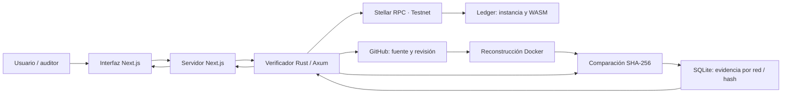

# Product Blueprint

**Nombre del proyecto:** CSV Verify — Contract Source Verify  
**Repositorio local / origen:** [angeldavid218/stellar-contract-verification](https://github.com/angeldavid218/stellar-contract-verification)  
**Repositorio de entrega del equipo:** [gchacon011/stellar-contract-verification](https://github.com/gchacon011/stellar-contract-verification)  
**Fecha:** 4 de octubre de 2026  
**Estado:** propuesta basada en evidencia del código; pendiente de contraste con Problem Brief y revisión colectiva.

> Este documento describe decisiones propuestas para el MVP y distingue las brechas del prototipo. No acredita consenso del equipo ni pruebas de operación que no se hayan realizado. La copia del vault es de consulta; la entrega académica debe quedar en `docs/semana2/` del repositorio del equipo.

## Contenido

1. Priorización de historias
2. Propuesta de valor
3. Flujo de usuario
4. Alcance del MVP
5. Lean Canvas
6. Backlog priorizado (Kanban)
7. Arquitectura inicial
8. Uso de Stellar y justificación

## 1. Priorización de historias

**Criterio:** MoSCoW y dependencias: primero demostrar correspondencia, evitar conclusiones falsas y asegurar reproducibilidad; después mejorar recuperación y acceso. El orden es de valor; la implementación empieza por preparar una fuente reproducible (HU-02).

| Orden | Historia | Propuesta por | Prioridad y motivo |
| :---: | --- | --- | --- |
| 1 | HU-01 · Verificar por Contract ID | [Angel Serrano](AngelSerrano.md) | Must: resultado central. |
| 2 | HU-04 · Interpretar estados distintos | Angel Serrano | Must: evita falsos positivos y conclusiones engañosas. |
| 3 | HU-02 · Preparar fuente y compilación | Angel Serrano | Must: habilita la reconstrucción. |
| 4 | HU-03 · Consultar evidencia completa | Angel Serrano | Must: permite revisar la conclusión. |
| 5 | HU-05 · Consultar evidencia vigente por red/hash | Angel Serrano | Must: evita reutilizar evidencia obsoleta. |
| 6 | HU-06 · Corregir y reintentar | Angel Serrano | Should: facilita adopción. |
| 7 | HU-07 · Comprender en español | Angel Serrano | Should: aprovecha la interfaz bilingüe existente. |

**Selección provisional:** únicamente se dispone de la propuesta individual anterior. El equipo debe contrastarla con las historias de los demás integrantes antes de aprobar la selección colectiva; no se atribuyen historias ni consenso que no se hayan aportado.

---

## 2. Propuesta de valor

**Usuario de referencia:** personas que evalúan contratos Soroban antes de utilizarlos, con desarrolladores y auditores como usuarios secundarios. Esta definición se infiere del README; debe contrastarse con el Problem Brief de semana 1, que no está disponible en el proyecto revisado.

CSV Verify entrega una respuesta trazable a una pregunta concreta: ¿el código fuente publicado puede producir el mismo WASM que está desplegado en Stellar? El usuario introduce un Contract ID y obtiene un resultado acompañado por la fuente identificada, las condiciones de compilación, los hashes comparados y la fecha de procesamiento. Así puede comprobar la correspondencia sin instalar herramientas de compilación ni reconstruir manualmente cada contrato.

La alternativa manual consiste en localizar el repositorio, identificar su revisión, preparar el entorno, descargar el artefacto de la red y comparar los archivos. Confiar solamente en un repositorio enlazado tampoco prueba que su contenido sea el código desplegado. La solución concentra ese proceso y expone evidencia revisable por terceros.

El desarrollador obtiene una forma de mostrar transparencia; el auditor puede comenzar su revisión sobre una fuente vinculada al artefacto consultado. La elección se apoya en reproducibilidad y claridad del resultado, no en una promesa general de seguridad: una coincidencia de hashes no descarta vulnerabilidades, privilegios administrativos ni riesgos económicos. El beneficio esperado es reducir trabajo repetitivo y mejorar la información disponible antes de una interacción. La reducción de tiempo y la adopción deben medirse en un piloto, no asumirse como resultados alcanzados.

---

## 3. Flujo de usuario

1. **Preparación del desarrollador.** Publica la fuente, fija una revisión y documenta el entorno de compilación; incorpora metadatos y despliega un contrato Soroban de prueba. Interactúa con el tutorial, Stellar CLI y Testnet. El MVP reproduce el formato que actualmente entiende el backend.
2. **Entrada del usuario.** Abre la pantalla de verificación, comprueba que la red es Testnet y pega el Contract ID. El formulario valida la entrada y ofrece mensajes comprensibles. Consultar el contrato no requiere conectar una wallet ni firmar transacciones.
3. **Consulta de evidencia.** El servicio consulta resultados persistidos. Para presentar uno como vigente, debe comprobar que el hash desplegado sigue siendo el mismo; si todavía no realiza esa comprobación, lo presenta como evidencia histórica fechada.
4. **Reconstrucción.** Cuando se requiere una verificación, el backend obtiene el WASM desde Stellar RPC, extrae metadatos, recupera la fuente y compila en un contenedor. La interfaz muestra un estado de espera; no presenta porcentajes de avance que el backend no reporta.
5. **Resultado.** La persona recibe una coincidencia, una diferencia entre hashes calculados o un resultado inconcluso con su causa. Puede revisar fuente, revisión, entorno y fecha; el auditor utiliza esa evidencia para profundizar.
6. **Recuperación y decisión.** Si falta información o falla la compilación, el desarrollador corrige la causa y reintenta. El usuario decide si necesita más revisión antes de interactuar con la aplicación externa. CSV Verify termina en la entrega de evidencia y no ejecuta esa interacción.

---

## 4. Alcance del MVP

| Dentro del MVP | Fuera del MVP |
| --- | --- |
| Consulta pública por Contract ID en Testnet, sin firma ni cuenta. | Mainnet, múltiples redes seleccionables y operaciones financieras. |
| Lectura de WASM, extracción de metadatos y reconstrucción para contratos con fuente pública y entorno compatible. | Repositorios privados, cualquier toolchain y compilaciones arbitrarias. |
| Comparación SHA-256 y evidencia: fuente, revisión, imagen, hashes y fecha. | Auditoría automática, certificación de seguridad y atestaciones firmadas. |
| Estados diferenciados, orientación ante fallos y consulta persistida por red/hash. | Monitoreo continuo, alertas y verificación masiva. |
| Tutorial de preparación e interfaz ES/EN existente. | Servicio comercial con SLA, cobros y registro on-chain propio. |

**Por qué el recorte sigue entregando valor:** conserva el ciclo mínimo completo: preparar un contrato reproducible, identificar el artefacto desplegado, reconstruirlo y entregar evidencia interpretable. Testnet permite validar este ciclo sin introducir transacciones con valor real. Exigir fuente pública y un entorno compatible limita casos soportados, pero mantiene verificable la promesa central.

**Condiciones para aceptar el MVP:** probar una coincidencia real, una reconstrucción con hashes distintos y un caso inconcluso; comprobar que un resultado anterior no se presenta como vigente después de cambiar el WASM. El prototipo ya contiene partes del flujo, pero la vigencia de caché, la interpretación uniforme de estados y la fijación del entorno requieren validación. La ampliación al vocabulario vigente de SEP-58 queda para una iteración posterior; durante el MVP se comunica expresamente el alcance del formato soportado.

---

## 5. Lean Canvas

**Enlace al Lean Canvas:** [Lean Canvas de CSV Verify](LeanCanvas.md).

El lienzo vive en este mismo repositorio y reúne los nueve bloques en una página de Markdown. Segmentos, ingresos y metas se identifican como hipótesis por validar; no representan clientes, facturación ni resultados del piloto.

---

## 6. Backlog priorizado (Kanban)

**Enlace al tablero Kanban:** [CSV Verify · Product Blueprint · Semana 2](https://github.com/users/angeldavid218/projects/2/views/1).

**Columnas:** **Backlog → Ready → In progress → In review → Done**. El orden P1–P7 de los títulos expresa la prioridad relativa; HU-01 a HU-05 son Must y HU-06/HU-07 son Should, según la sección 1. Las siete tarjetas empiezan en Backlog: la presencia de código no acredita por sí sola cumplimiento de sus criterios.

Cada tarjeta contiene la historia y criterios de aceptación comprobables. Ready exige historia y criterios definidos; In review exige evidencia de prueba; Done exige criterios cumplidos y revisión del equipo. El equipo asignará responsables al validar la selección colectiva. El backlog operativo vive en GitHub Projects y no se duplica como archivo de entrega.

El tablero es público y está vinculado al repositorio `angeldavid218/stellar-contract-verification`. El repositorio de entrega confirmado es `gchacon011/stellar-contract-verification`; este mismo tablero público se enlaza desde el documento y puede vincularse también a ese repositorio.

---

## 7. Arquitectura inicial

La interfaz usa Next.js, React y TypeScript. El formulario envía un Contract ID a las acciones y rutas del servidor; el navegador no accede directamente al backend. La dirección del verificador permanece en la configuración del servidor. Esta capa entrega respuestas estructuradas para consulta y presentación.

La lógica de verificación está en un backend Rust con Axum, consultado en la rama `demo-backend` del repositorio `sebasberrios-dev/stellar-contract-verification`. No está presente en el checkout local revisado. El backend recupera el artefacto desplegado, interpreta metadatos, obtiene la fuente y solicita la reconstrucción a Docker. Calcula SHA-256 sobre ambos artefactos y persiste el resultado en SQLite, asociado al contrato, red y hash. GitHub aporta la fuente; SQLite almacena evidencia derivada, no sustituye la red.

**La red entra** cuando Stellar RPC resuelve la instancia del contrato y recupera el código WASM mediante lecturas del ledger. La reconstrucción y comparación ocurren fuera de Stellar. No se necesita desplegar un contrato adicional ni escribir resultados on-chain.

**Decisiones iniciales:** conservar esta separación y acotar la ejecución a fuentes públicas y entornos compatibles. Fijar imágenes por digest, validar su origen y limitar recursos son condiciones de reproducibilidad y operación; no se consideran resueltas sólo por usar Docker. El GET actual consulta persistencia sin comprobar el hash en la red, mientras que POST sí obtiene el WASM antes de reutilizar caché. El MVP debe cerrar esa diferencia o identificar explícitamente la consulta como histórica.

---

## 8. Uso de Stellar y justificación

**Criterio de pertinencia propuesto:** Stellar es pertinente porque el objeto que se verifica es un contrato Soroban desplegado en su ledger. Esta formulación deriva del producto y debe cotejarse con el Problem Brief; no se atribuye al documento ausente.

| Componente | Uso y justificación |
| --- | --- |
| Soroban y WASM | El contrato desplegado es el artefacto contra el que se compara; una copia local del desarrollador no acredita qué código está en la red. |
| Stellar RPC | Recupera instancia y código mediante `getLedgerEntries`; conecta la evidencia con la red consultada. |
| Stellar CLI y SDK | Permiten al desarrollador compilar y desplegar contratos de prueba, y al verificador reproducir entornos compatibles. |
| Testnet | Acota el piloto técnico y permite ensayar el flujo antes de ampliar la cobertura. |

Los metadatos del WASM aportan información para reconstruirlo. El proyecto utiliza `source_repo`, `source_rev`, `bldimg` y `bldopt`; son el formato actualmente implementado, no una garantía de compatibilidad plena con la especificación vigente. [SEP-58 v0.6.0](https://github.com/stellar/stellar-protocol/blob/master/ecosystem/sep-0058.md), todavía Draft, identifica la fuente mediante `source_sha256` y opcionalmente `source_uri`, e incluye `bldarg`. Esa diferencia exige una migración explícita antes de declarar conformidad.

La verificación es de lectura: no necesita pagos en XLM, firma de wallet ni contrato registrador propio. Freighter puede conservarse como integración opcional existente, pero no agrega evidencia a la comparación. [Stellar RPC](https://developers.stellar.org/docs/data/apis/rpc/api-reference/methods/getLedgerEntries) aporta el dato desplegado; la validez del resultado también depende del entorno reproducido y de la implementación del verificador.
